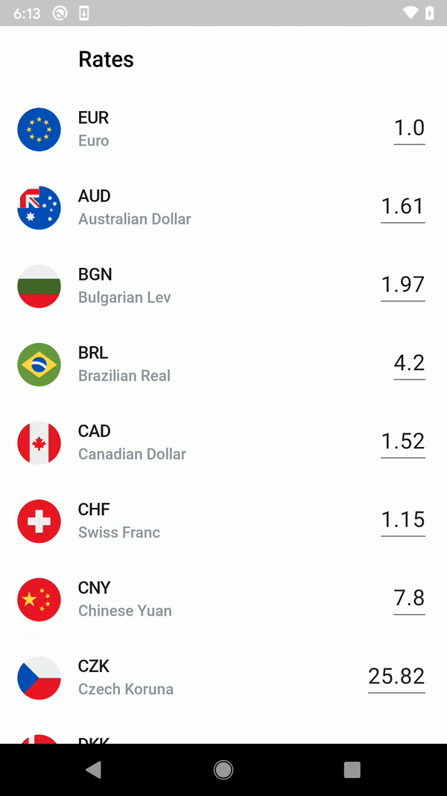

# CurrencyRates
This is a production ready Android app to showcase a popular tech stack in Android development.

- Every second it fetches current currency rates, calculates the amount (which depends on the user input) and updates the UI
- A user can interact with the app by selecting new base currency and changing the amount (to which all other currencies will be calculated)
- It uses state management to achieve better results and readable code
- If network is disabled and then enabled, it will start to fetch data again
- It handles rotations because of the ViewModel
- The app is unit tested

### Tech stack
- MVVM
- RxJava2
- LiveData
- Dagger2
- Retrofit
- Navigation component
- MockK for testing
- Kotlin
- Ktlint for static code analysis (used from terminal)

